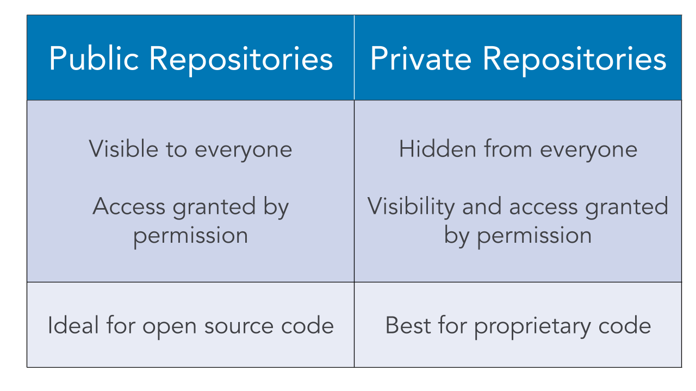

# 01_01 Public and Private Repositories
Repositories can be either public or private.

<!-- FooterStart -->
---
[← 0. Introduction](../../ch0_intro/README.md) | [01_02 Add Files to a Repository →](../01_02_add_files/README.md)
<!-- FooterEnd -->
