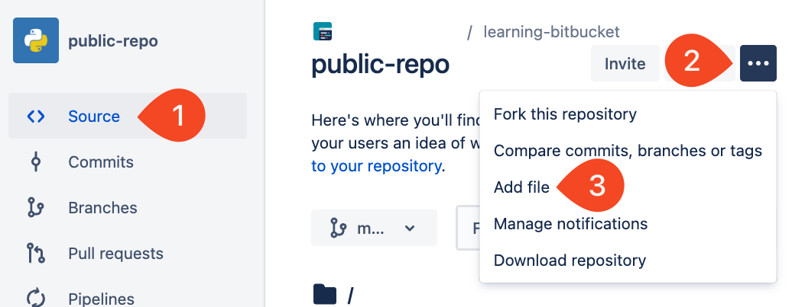

# 01_02 Add Files to a Repository
Follow these steps to add files to a Bitbucket repository using the web interface.

1. Select **Source**
1. Select **...**
1. Select **Add file**

    

1. Add the file name
1. Enter the file contents
1. Select **Commit**
1. Add a commit message or accept the default message.
1. Select **Commit**

## Summary
Adding files from the web UI is great but you’ll be better served by cloning a repository to your local system and working with the files there.

<!-- FooterStart -->
---
[← 01_01 Public and Private Repositories](../01_01_public_and_private_repositories/README.md) | [01_03 Add an SSH Key for Authentication →](../01_03_add_an_ssh_key_for_authentication/README.md)
<!-- FooterEnd -->
