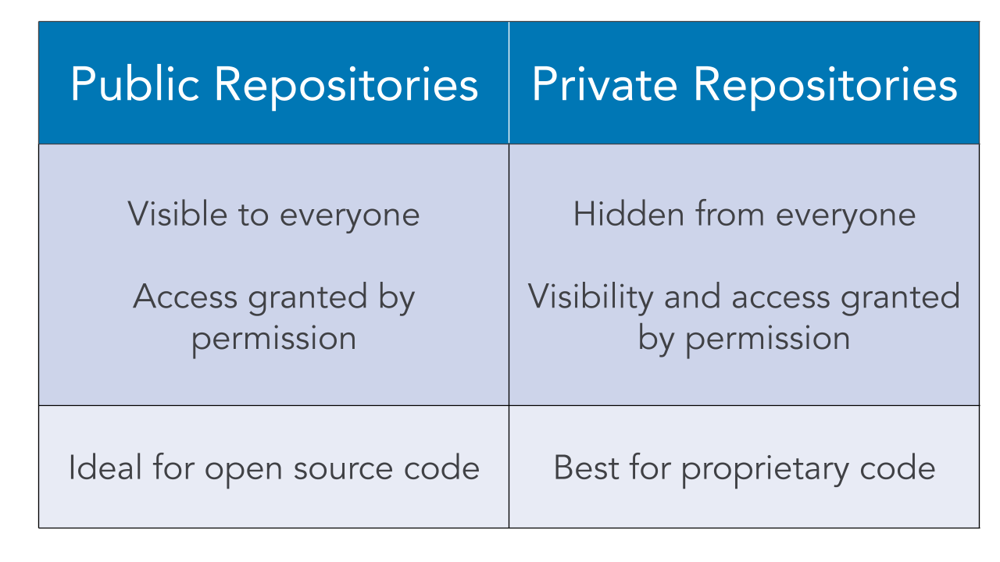

# 01_01 public and private repositories
Repositories can be either public or private.

<!-- FooterStart -->
---
[← 00_04 Bitbucket Content Organization](../../ch0_introduction/00_04_bitbucket_content_organization/README.md) | [01_02 add files to a repository →](../01_02_add_files_to_a_repository/README.md)
<!-- FooterEnd -->
