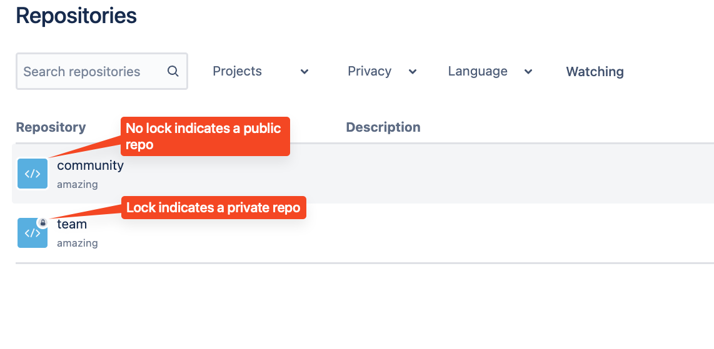

# 01_07 Solution: Create a Repo and Push Code

## Challenge Scenario
Let’s use a challenge to apply what you’ve learned about Bitbucket.

You’re part of a software development team working on a new, open source application.  The team is inviting the community to work with them and they need a cloud-based repository service to store the code.

The team is asking you to configure Bitbucket so the community can see their progress.  However, they also need to work with some files separately and discretely, away from the application’s code base.

## Challenge Tasks
1. Log into Bitbucket and create a new workspace.
1. In the new workspace, create a project named **`amazing`** with two repositories.
1. The first repo should be named **`source`**.  This repo should be visible to anyone with the URL.
1. The second repo should be named **`team`** and should only be visible by members of the team.
1. Clone both repos to your local system and add a markdown file named **`CONTRIBUTING.md`** to each repo.
1. Push the files back to Bitbucket with the commit message **`repo is ready`**.
1. Confirm that both repos have been created per the team's requirements.

This challenge should take about 15 minutes to complete.

## Solution

### Create the workspace, project, and repositories
1. Log into Bitbucket and browse the [workspaces homepage](https://bitbucket.org/account/workspaces/).
1. Select **Create Workspace**.
    1. Enter a name for the workspace.  Because workspace names must be globally unique, pick a workspace name that is unique and easy to recall.
    1. **Deselect the checkbox** next to "Keep this workspace private".
    1. Select **Create**.
1. Select **Create Repository**.
    1. In the "Project name" field, enter **`amazing`**.
    1. In the "Repository name" field, enter **`source`**
    1. **Deselect the checkbox** next to "Private repository".
    1. Select **Create Repository**.
1. From the menu bar near the top of the page, select **Create -> Repository**.
    1. Next to "Project", select **Select project -> amazing**.
    1. In the "Repository name" field, enter **`team`**
    1. Confirm that the checkbox is selected next to "Private repository".
    1. Select **Create Repository**.
1. From the menu bar near the top of the page, select **Repositories**.
1. Confirm that the **source** repository does *not* have a lock icon, indicating the repo is public.
1. Confirm that the **team** repository has a lock icon, indicating the repo is private.

    
### Clone the repositories to your local system

*Repeat the same steps for the **source** and **team** repositories*.

1. Open the homepage for the repository.
1. Select the **Clone** button on the top, right hand side of the page.
1. On the dialog that appears, confirm that **SSH** is selected and then select the stacked squares icon next to the `git clone ...` command.

    

1. Open a terminal on your local system.  Paste and run the `git clone` command.
1. Change directories into the repo's working directory: `cd team` or `cd source`.
1. Create an empty file named `CONTRIBUTING.md`

    | Operating System     | Command                                           |
    |----------------------|---------------------------------------------------|
    | macOS, Linux, and WSL      | `touch CONTRIBUTING.md`                          |
    | Windows (CMD) | `type nul > CONTRIBUTING.md`                   |
    | Windows (PowerShell)   | `New-Item -ItemType File -Name CONTRIBUTING.md`  |

1. Stage the file to be committed: `git add CONTRIBUTING.md` or `git add .`
1. Create a new commit: `git commit -m "repo is ready"`

    > *NOTE: If you run `git commit`  and see the error "Author identity unknown", follow the directions to configure your name and email using `git config`.  Review the following documents for more details:*
    > - [Atlassian Support: Configure your DVCS username for commits](https://support.atlassian.com/bitbucket-cloud/docs/configure-your-dvcs-username-for-commits/)*
    > - [Pro Git: Getting Started - First-Time Git Set](https://git-scm.com/book/en/v2/Getting-Started-First-Time-Git-Setup)* 

1. Push the commit: `git push`

### Conclustion
Go back to the BitBucket web interface and review the workspace, project, repositories, files, and commit messages.

