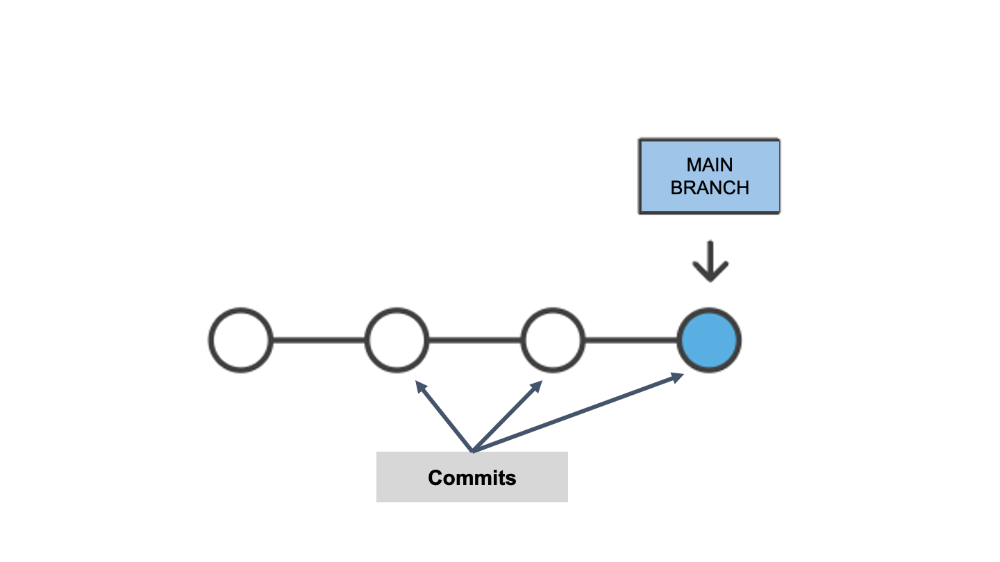
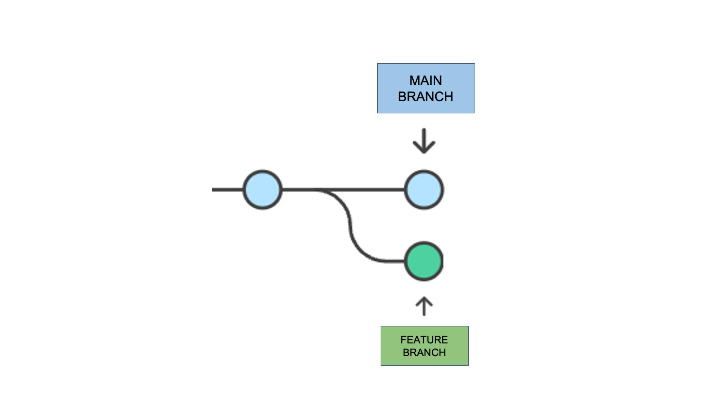
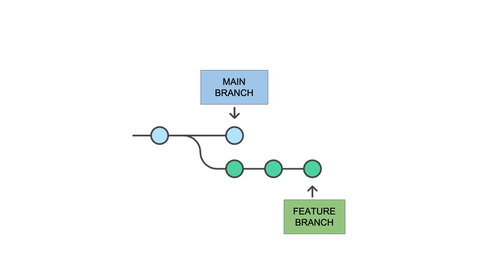
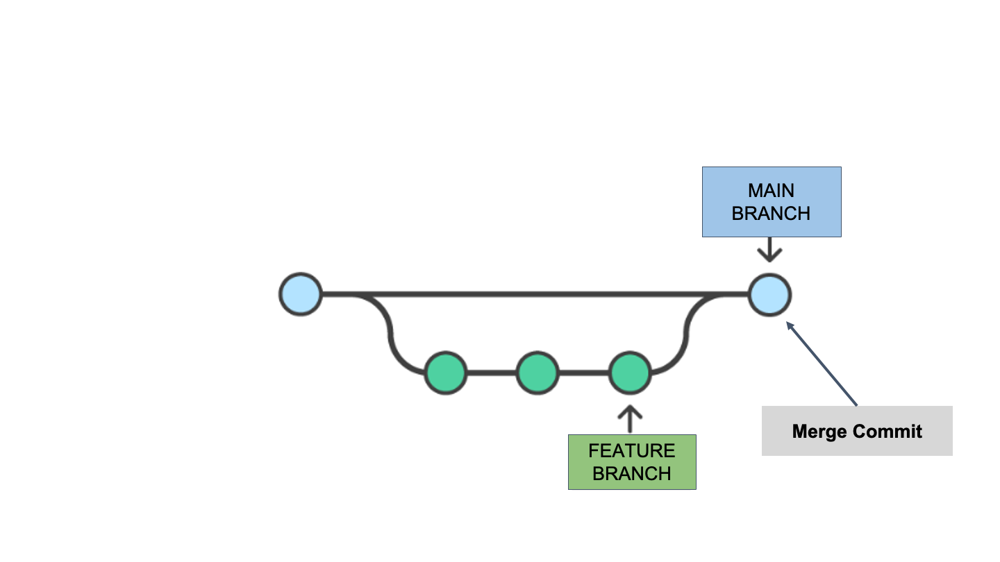
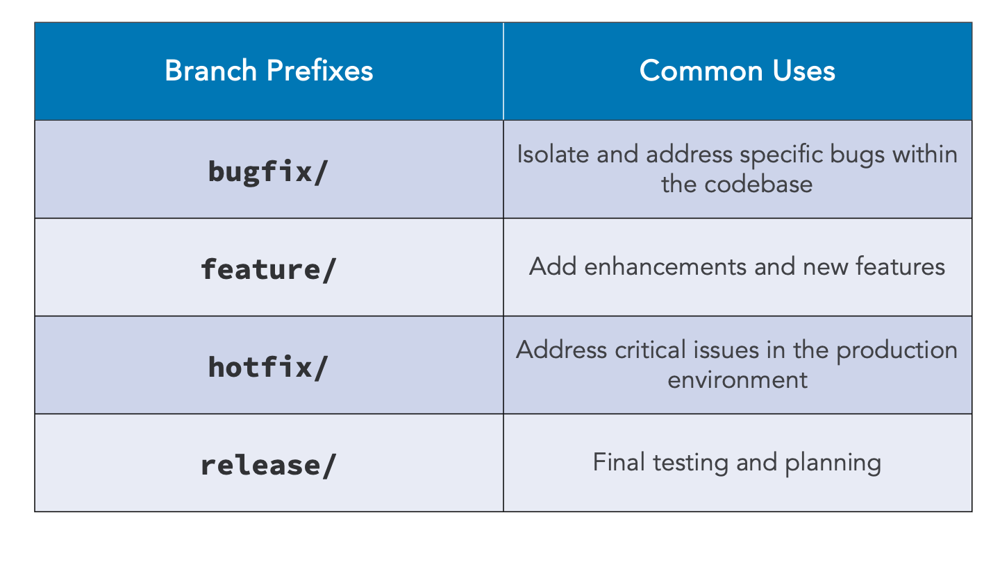

# 02_01 Create a Branch

## Branches

- Point to specific commits in a repo history

- Isolate work on new features without affecting the primary code base

- Allow work on files at the same time without interference

1. Visualize the main branch as a line, with each commit represented as a dot on the line.

    

1. Create branches from commits on the main branch.

    

1. As new or modified files are pushed to the branch, new commits are added.  

    

1. Once the work is complete and verified, branches are merged back into the main branch.

    The point created when two branches are merged is called a **merge commit**.

    

## Branch Names and Naming Conventions

- Branches are named according to the reason for creating the branch

- Naming convention is a prefix followed by **"/"**

- Common prefixes include:

  - `bugfix`
  - `feature`
  - `hotfix`
  - `release`

<!-- FooterStart -->
---
[← 01_07 Solution: Create a Repo and Push Code](../../ch1_get_started/01_08_solution1/README.md) | [02_02 Push Code to a Branch →](../02_02_push_to_branch/README.md)
<!-- FooterEnd -->
