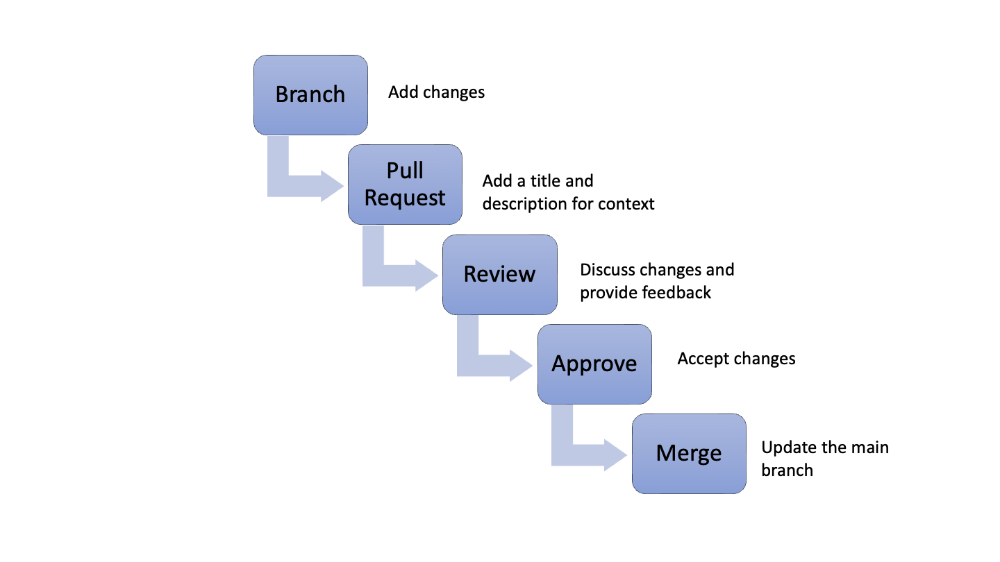

# 02_03 Create a Pull Request

## Pull Requests

Pull requests create a special checkpoint in the software development process.

- Abbreviated as “PR”
- A request to merge changes from one branch into another
- Changes may include new features or bug fixes

Pull requests provide a framework for:

- Collaboration
- Reviewing changes
- Providing feedback
- Supporting code quality

## Pull Request Workflow

1. Branch - Create a branch and add changes
1. Pull Request - Create a pull request with a title and description that add context to the changes
1. Review - Discuss changes and provide feedback
1. Approve - Accept changes
1. Merge - Update the `main` branch

## SHENANIGANS!
Merging is great but what happens if someone has changed the exact same code on the source branch?

You'll encounter a **merge conflict**.

No worries!  There are ways to get around conflicts.  

Check out this Atlassian documentation on resolving merge conflicts on your local system:
- [Resolve Merge Conflicts](https://support.atlassian.com/bitbucket-cloud/docs/resolve-merge-conflicts/)

<!-- FooterStart -->
---
[← 02_02 Push Code to a Branch](../02_02_push_to_branch/README.md) | [02_04 Challenge: Create and Merge a Pull Request →](../02_04_challenge1/README.md)
<!-- FooterEnd -->
