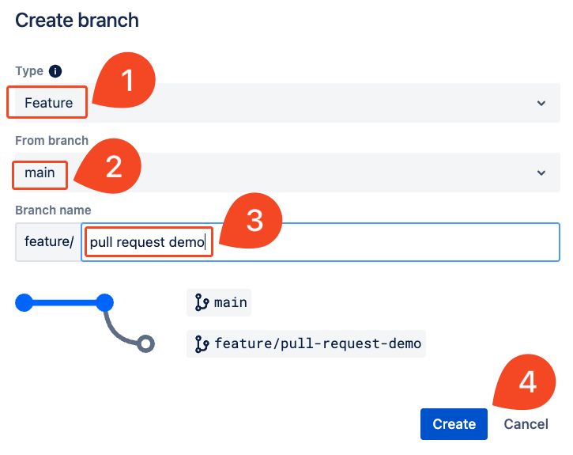
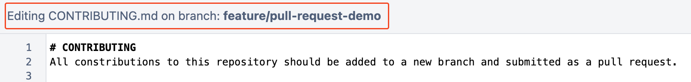
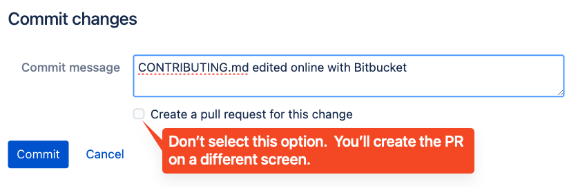
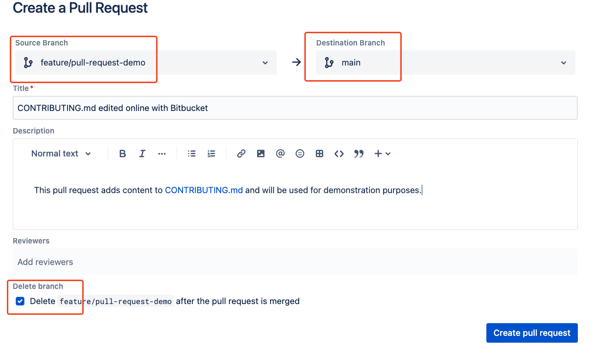
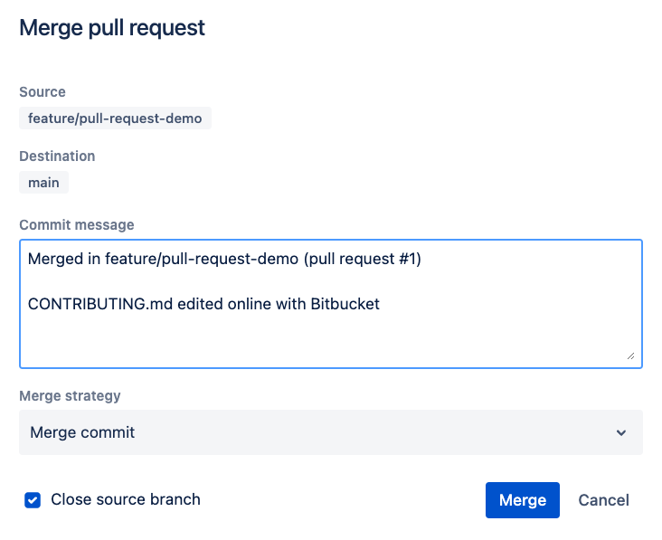
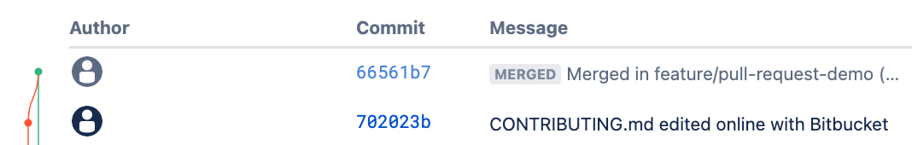

# 02_05 Solution: Create and Merge a Pull Request

## Challenge Scenario
Let’s use another challenge to practice what you’ve learned about Bitbucket.

In the previous challenge, you configured Bitbucket for The Amazing App project.  You created two repositories; one for contributions from the community and another for the team's internal files.

Now let's test your Bitbucket skills again.

As the Bitbucket expert for the team, you’ve been given another task: Demonstrate how the team should review updates to the open-source repo by using branches and pull requests.

## Challenge Tasks
> *NOTE: If you haven't completed the challenge for Chapter 1, review and complete the steps for [01_07 Solution: Create a Repo and Push Code](../../ch1_getting_started_with_bitbucket/01_07_solution_create_a_repo_and_add_code/README.md) before proceeding with this challenge.*
>
> *TLDR? create the following:*
>- *Workspace*
>- *Public repository named `community`*
>- *File named `CONTRIBUTING.md`.*

1. Log into Bitbucket and locate the workspace containing the **community** repository you created in the previous challenge.
1. Inside the **community** repository, create a feature branch named `pull-request-demo`.

    > *Note that this should be a feature branch.*

1. Update the file named `CONTRIBUTING.md` with the following message:

    ```
    # CONTRIBUTING
    All constributions to this repository should be added to a new branch and submitted as a pull request.
    ```

1. Commit the changes to the branch.  Do not create a pull request from the commit interface.
1. Use the **Pull Request** tab on the sidebar menu to create a pull request from the feature branch into the `main` branch.
1. Review the pull request and then merge the request into the `main` branch.

This challenge should take about 15 minutes to complete.

## Solution

### 1. Create a branch and add changes
1. Log into Bitbucket and browse the [workspaces homepage](https://bitbucket.org/account/workspaces/).
1. Select the workspace you created in the first challenge.
1. On the workspace overview, select the **community** repository.
1. Select **Branches** on the left sidebar.
1. Select **Create branch**.

    1. Under **Type**, select **feature**.  *Note how the **Branch name** field is updated to reflect the selected branch type.*
    1. Confirm that **main** is selected under **From branch**.
    1. Under **Branch name**, enter `pull request demo`.
    1. Select **Create**.

    

1. Select **View source**.
1. Select **CONTRIBUTING.md**.
1. Select **Edit**.  Modify the file by adding the text as described in the challenge.

    > *NOTE: Confirm that the file is being edited on the branch named `feature/pull-request-demo`.*

    

1. Select **Preview**. Review and confirm your changes.
1. Select **Commit**.
1. On the **Commit changes** dialog, update the commit message.

    > *NOTE: **DO NOT** select "Create a pull request for this change"*

    

1. Select **Commit**.

### 2. Create and merge a pull request
1. Select **Pull requests** on the left sidebar.
1. Select **Create pull request**.
1. Confirm that the **Source Branch** is `feature/pull-request-demo`
and **Destination Branch** is `main`.
1. Enter a description.
1. Select the checkbox next to **Delete `feature/pull-request-demo` after the pull request is merged**.

    

1. Select **Create pull request**
1. Select **Approve**.
1. Select **Merge**.
1. Review the **Merge pull request dialog**. Select **Merge**.

    

## Conclusion
After the merge is complete, select **Commits** on the left sidebar.  Review the branch pattern created by committing to the feature branch and merging the branch into the `main` branch.


