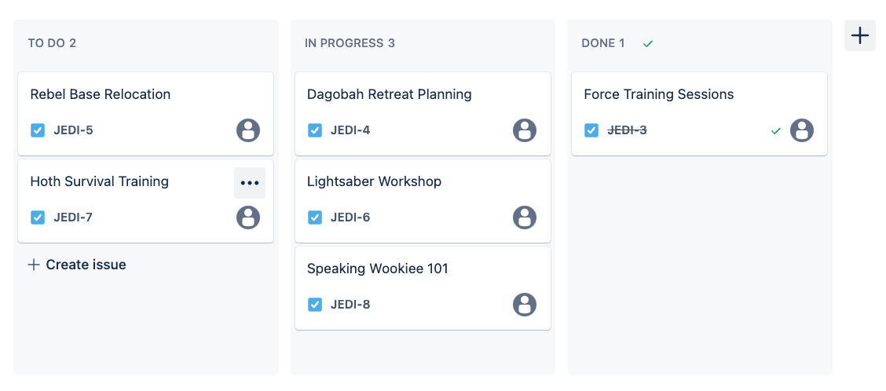

# 03_01 Manage Projects with Jira and Bitbucket

## Jira

- Project management tool used in software development

- Supports various project management methodologies

- Issues, tasks, and stories are used to track work

## Jira Boards and Tasks

Tasks can be assigned, categorized, and then tracked through various stages of completion including:

- To Do
- In Progress
- Done

## Integrating Jira with Bitbucket

- Enhances the software development process by linking code changes directly to their corresponding tasks.

- Result is better communication and transparency across the project.

<!-- FooterStart -->
---
[← 2. Working with Branches and Pull Requests](../../ch2_branches_pr/README.md) | [03_02 Connect Jira to Bitbucket →](../03_02_connect_jira/README.md)
<!-- FooterEnd -->
