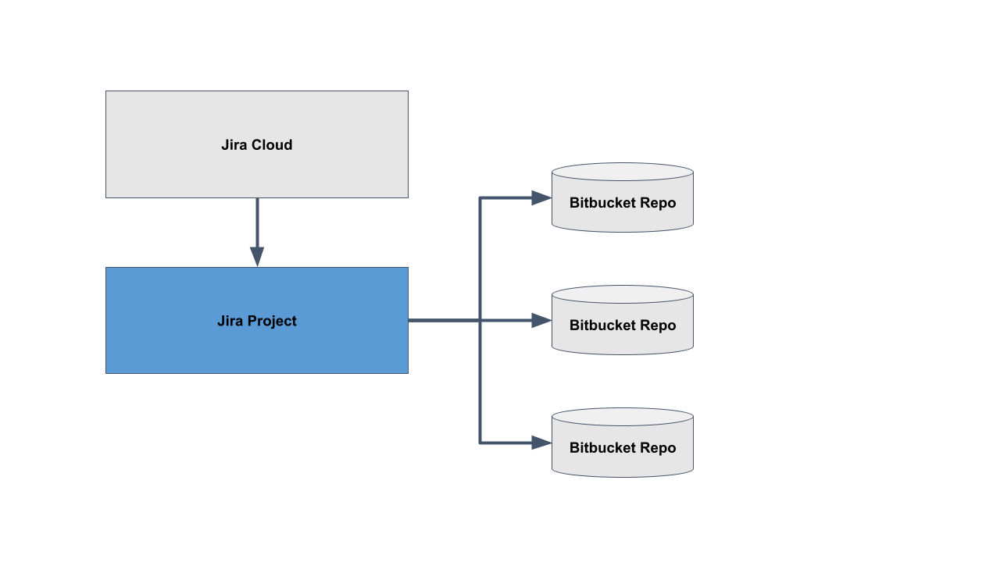

# 03_02 Connect Jira to Bitbucket

1. Create an account in [Jira Cloud](https://jira.atlassian.com/).

1. Create a Jira project.

1. Connect the Jira project to one or more Bitbucket repositories.

Review the following documentaiton for more details:

- [Connect Jira Cloud to Bitbucket](https://support.atlassian.com/jira-cloud-administration/docs/connect-jira-cloud-to-bitbucket/)

- [Integrate Bitbucket with Jira](https://support.atlassian.com/jira-cloud-administration/docs/integrate-bitbucket-with-jira/)

<!-- FooterStart -->
---
[← 03_01 Manage Projects with Jira and Bitbucket](../03_01_manage_projects_with_jira_and_bitbucket/README.md) | [03_03 Connect Jira to Bitbucket →](../03_03_automate_issue_updates/README.md)
<!-- FooterEnd -->
