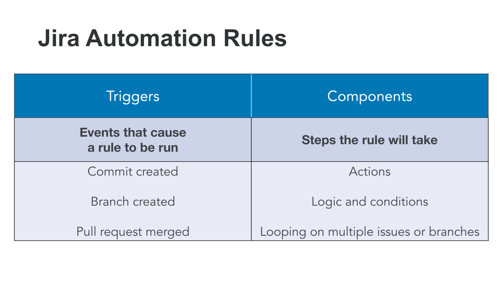

# 03_03 Automate Issue Updates

## Jira Automation

- Synchronizes project management and code development activities 

- Reflects the real time status of work being done

- Allows collaboration while team members use the tool they are familiar with

## Jira Automation Rules

Jira uses rules to describe the triggers and components that implement automation.

<!-- FooterStart -->
---
[← 03_02 connect jira to bitbucket](../03_02_connect_jira_to_bitbucket/README.md) | [03_04 create an issue and link to bitbucket branch →](../03_04_create_an_issue_and_link_to_bitbucket_branch/README.md)
<!-- FooterEnd -->
