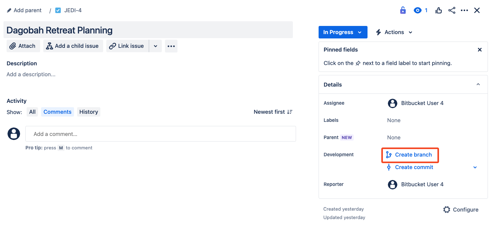

# 03_04 Create an Issue and Link to a Bitbucket Branch

<!-- FooterStart -->
---
[← 03_03 Automate Issue Updates](../03_03_automate_issue_updates/README.md) | [03_05 Update and Close Issues from Bitbucket →](../03_05_update_and_close_issues_from_bitbucket/README.md)
<!-- FooterEnd -->
