# 03_07 Solution: Trigger Jira Automation from Bitbucket

## Challege Scenario
In this challenge, you’ll continue your role as the Bitbucket expert on the team developing the Amazing Mobile App.

Since the last challenge, the application has grown in popularity and has millions of daily active users.  The team has decided to bring on a project manager to help streamline new features and prioritize bug fixes.

Your task is to set up a Jira project, connect it to existing repositories, and demonstrate how the team can manage issues using automation rules, branches, and pull requests.

## Challenge Tasks
> *NOTE: If you haven't completed the challenges for Chapters 1 and 2, review and complete the steps for the following before proceeding with this challenge:
>-  [01_07 Solution: Create a Repo and Push Code](../../ch1_getting_started_with_bitbucket/01_07_solution_create_a_repo_and_add_code/README.md)
>- [02_05 Solution: Create and Merge a Pull Request](../../ch2_working_with_branches_and_pull_requests/02_05_solution_create_and_merge_a_pull_request/README.md)

To complete this challenge you’ll need to:

1. Create a Jira project using the following specifications:
    - Use a team managed project
    - Use a Kanban board with columns for **To do**, **In Progress**, and **Done**.
1. Connect the Jira project to the Bitbucket workspace containing the `community` and `team` repositories.
1. Create automation rules that will update the state of issues linked to a branch.
1. Create a new issue in Jira.
1. From the issue, create a feature branch in the `team` repo named `roadmap`.
1. In Bitbucket, add a file named `ROADMAP.md` and add the following text:

        # ROADMAP
        1. Fix bugs
        1. Deploy new features
        1. Innovate for the future

1. Use the feature branch to create and merge a pull request.
1. Confirm that the automation rules in Jira have moved the issue from "To do" to "In Progress" and "Done".

If you’ve been following along with the challenges so far, this challenge should take about 45 minutes to complete.

## Challenge Solution

### 1. Create a Jira Project
1. Start in the `team` repository
1. in the sidebar, select **Jira issues**.  select **Try jira free**
    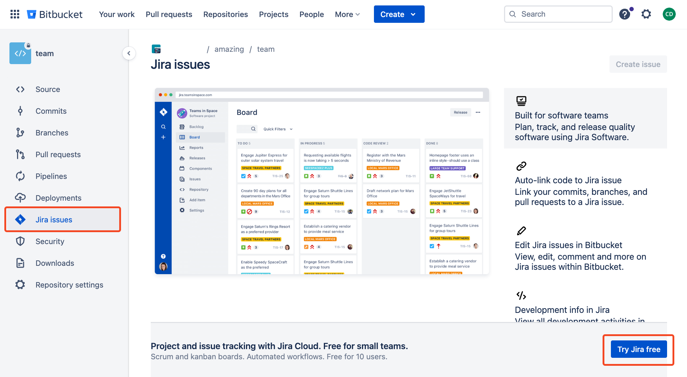
1. Create a new Jira site by providing a name.  Select **Continue**.
1. Confirm the free plan is in place and select **Get Started**.  Wait for the installation to complete.  When the installation is complete, select **Go to Jira Software**.
1. On the screen with "Select a template...", select **KANBAN: A simple board to visualize your workflow**.  Then select **Next**.
1. Create a project.  For team name enter "Amazing Mobile App".  Select **Create project**.
1. On the screen with "Select some tools...", select **Skip**.
1. On the screen with "Which best describes you?", select the best choice for you and then select **Start using Jira**.  *If you are prompted for the **Quickstart Tour**, complete the tour or dismiss the icon on the bottom right of the screen.*

### 2. Connect the Jira project to  Bitbucket
1. On the left sidebar, select **Code**.
1. Select **Connect to Bitbucket**.
1. Select the workspace that contains the `team` and `community` repositories.  Then select **connect**.  After the connection is made, select **continue**.
    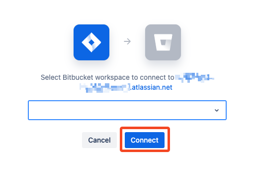
1. Select **Edit repositories**
    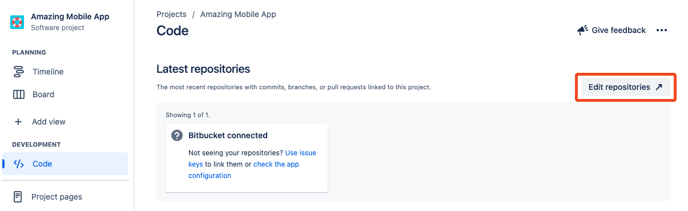
1. Select **Add** -> **Add code repository**
1. Under **Select repository provider**, select **Bitbucket**.  Then select the **community** and **team** repositories.  Select **Add repository**.
    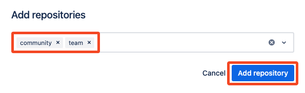

### 3. Create Automation Rules
1. On the left-side navigation, select **Automation**. *If you are not already on the **Project Settings** page, from the project homepage, select **Project Settings** -> **Automation**.*
1. Confirm that the **Templates** tab is selected and scroll down to the **DevOps** section.  You'll be adding the two rules selected in the following image:
    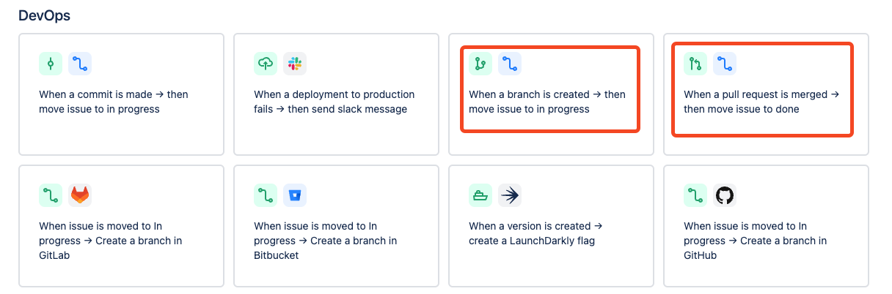
1. Select the tile for **When a branch is created → then move issue to in progress**.
1. Select **Turn on rule**.  Then select **Return to rules**.
1. Select the **Templates** tab and scroll down to the **DevOps** section.
1. Select the tile for **When a pull request is merged → then move issue to done**.
1. Select **Turn on rule**.  Then select **Return to rules**.
1. With both rules enabled, your listing for the **Rules** tab should be similar to the following image:
    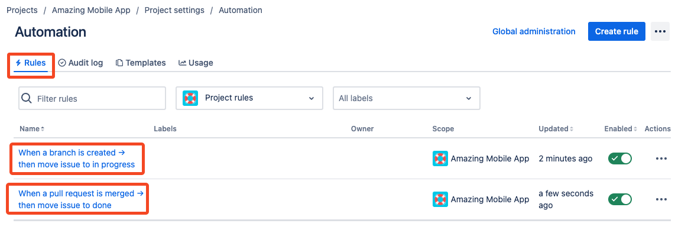

### 4. Create a new issue in Jira
1. Select **Back to project** to return to the project's home page.
1. In the **To do** column, select **+ Create issue**.  Enter the text `Add roadmap document` and press enter.  *If you are prompted to add additional tools to the project (ie, Slack), select **Dismiss**.*
    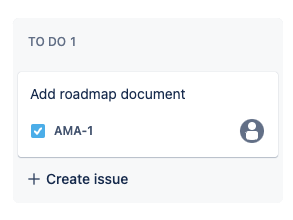
1. Open the issue by selecting the link created by the text you just entered.

### 5. Create a Feature Branch From the Issue
1. Select **Create branch**.
    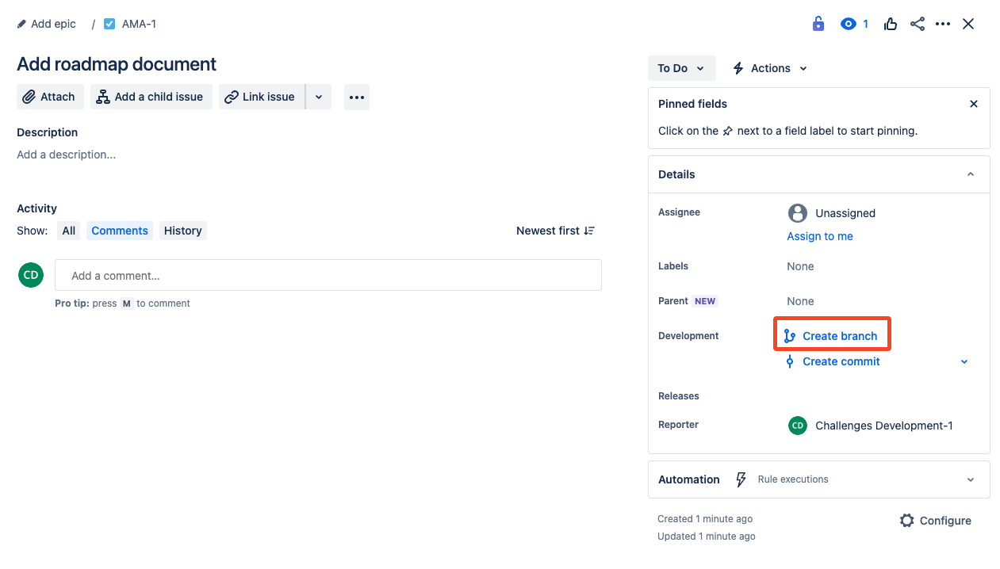
1. A new tab should open with a tab to create a branch in Bitbucket. Under **Repository**, select the `team` repo.  Under **Type** select feature.  Select **Create**.
    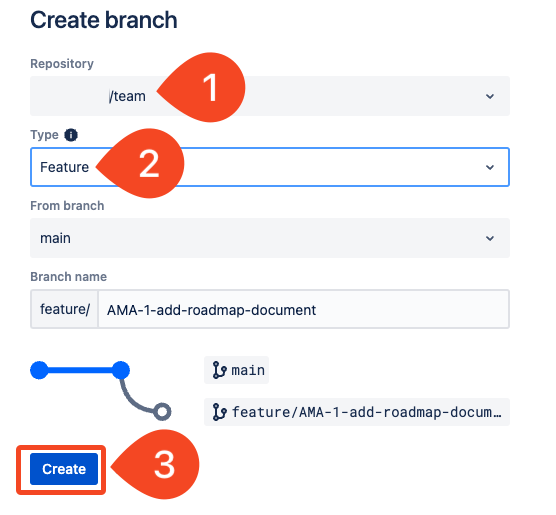

### 6. Add the Roadmap File
1. On the homepage for the branch, select **View source**.
1. On the far right side of the source page, select the three dot menu, then select **Add file**.
    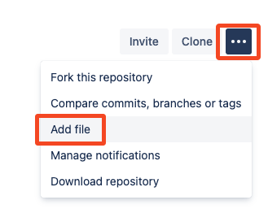
1. For the file name, enter `ROADMAP.md`.
1. In the file editor, enter the text provided in the [Challenge Tasks](#challenge-tasks).  When all of the text is in place, select **Preview**.
1. If needed, select **Edit file** to make changes.  Otherwise select **Commit**.
1. Update the commit message and select **Commit**.
1. Go back to the browser tab where Jira is running and confirm that the issue has been moved to the **IN PROGRESS** column.
    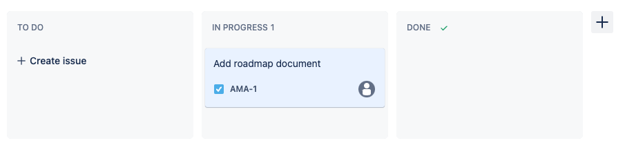

### 7. Create and Merge a Pull Request
1. Back in Bitbucket, select **Pull requests**.  Then select **Create pull request**.
1. Enter a description for the PR, select the checkbox under **Delete branch**, and then select "Create pull request**.
    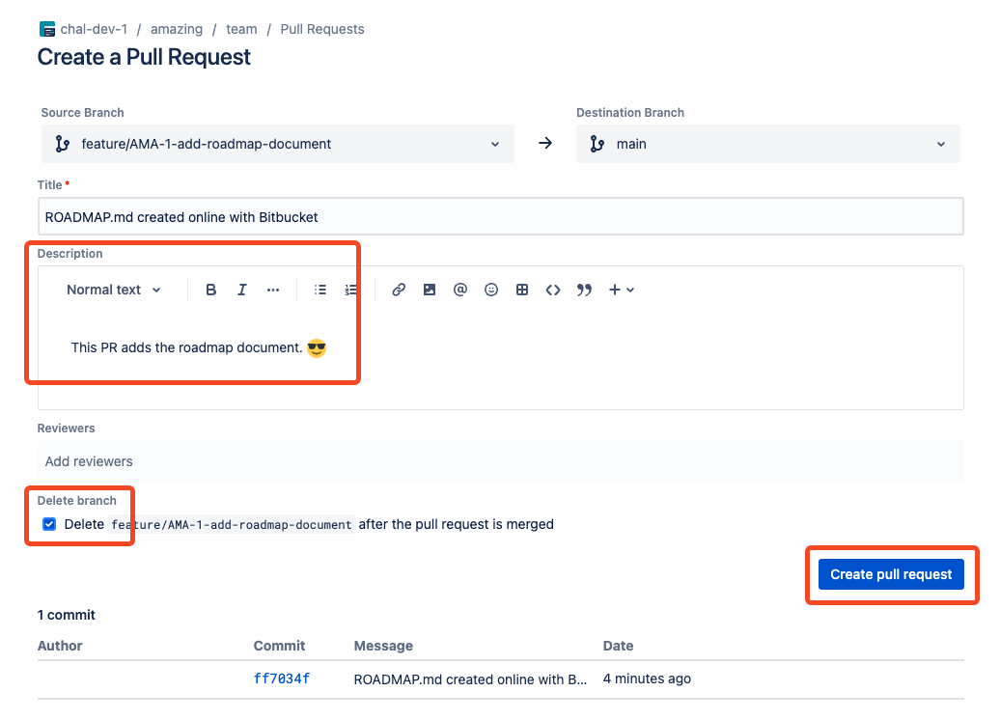
1. On the pull request page, select **Merge**.  On the form that appears, select **Merge**.
    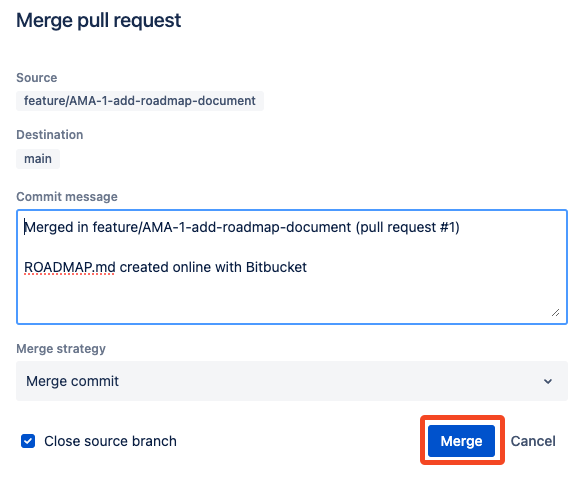
1. Once the merge is complete, go back to the browser tab where Jira is running.
1. Confirm that the issue has been moved to the **DONE** column.
    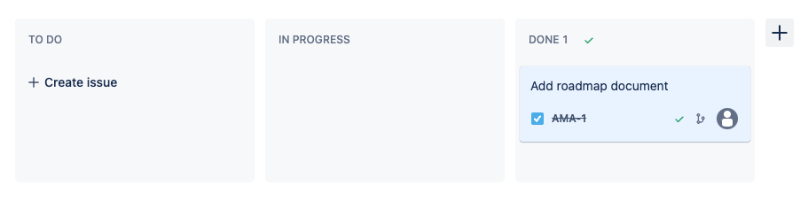

### 8. Confirm Automation Rule Activity
If your automation rules are in place, you hav observed how the issue was updated in the previous steps.  This task offers one more way to validate the rules were triggered as expected.

1. Open the issue.  
2. On the lower right-hand side under **Automation**, select **Refresh**.  Review the rules that were recently run by this issue.
    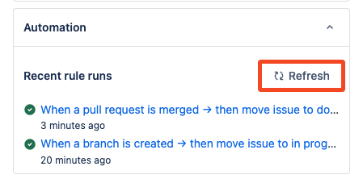

## Conclusion
This challenge prodives reinforcement for the the following concepts:

- Integrating Jira with Bitbucket
- Using branches for feature development
- Adding new code to the primary codebase by using pull requests
- Automating issue updates in Jira with automation rules.

<!-- FooterStart -->
---
[← 03_06 challenge: link a bitbucket branch to jira cloud](../03_06_challenge_trigger_jira_automation_from_bitbucket/README.md) | [04_01 Next Steps →](../../ch4_conclusion/04_01_next_steps/README.md)
<!-- FooterEnd -->
